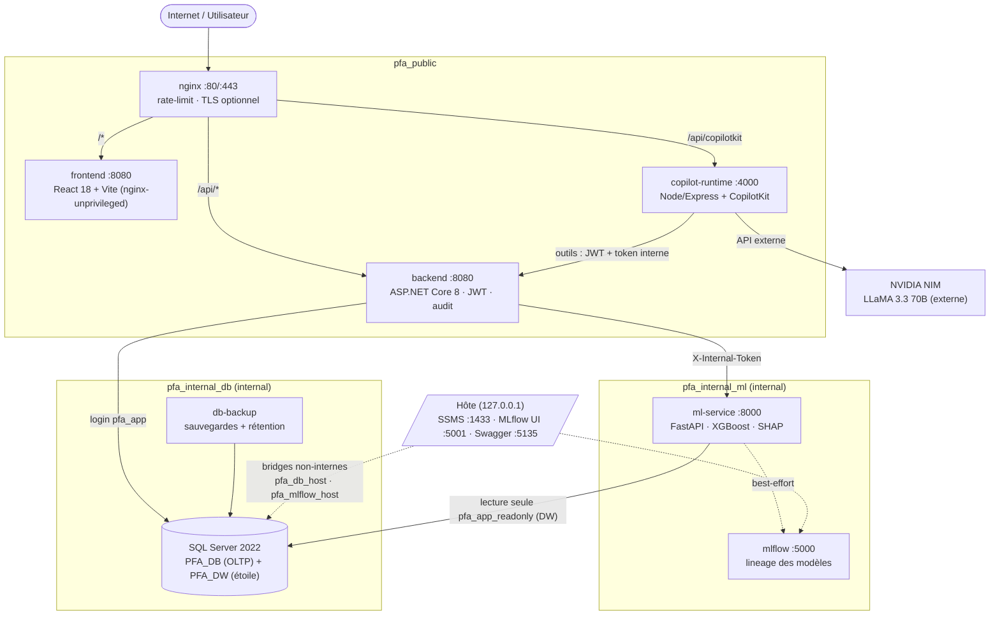

# Architecture — Plateforme Décisionnelle ENIAD 2025/2026

Huit services orchestrés par Docker Compose, segmentés en cinq réseaux. Les plans
DB et ML sont `internal: true` : injoignables depuis Internet par construction.
Le Copilot est un sidecar optionnel — jamais un gate de démarrage, la plateforme
BI reste disponible s'il tombe.

## Points clés à défendre

- **Segmentation réseau** : `pfa_internal_db` et `pfa_internal_ml` sont `internal: true`.
  Les bridges `pfa_db_host` / `pfa_mlflow_host` existent uniquement pour publier
  les ports 127.0.0.1 vers l'hôte (un conteneur attaché seulement à des réseaux
  internes ne peut pas publier de port hôte).
- **Moindre privilège SQL** : `sa` (admin uniquement) · `pfa_app` (backend,
  datareader + datawriter) · `pfa_app_readonly` (ML/Copilot, lecture seule sur PFA_DW).
- **Démarrage gaté** : nginx dépend de `/ready` du backend (DB joignable **et**
  marqueur de schéma présent) — le trafic n'est admis qu'après provisionnement.
- **Dégradation gracieuse** : ML indisponible → prédiction enregistrée avec statut
  d'échec, la BI reste up. Copilot down → la plateforme fonctionne sans lui.
- **Flux Copilot** : cookie de session HTTP-only 15 min → runtime vérifie le JWT →
  callbacks d'outils doublement gatés (JWT utilisateur + `AGENT_INTERNAL_TOKEN`).
  `query_dw` = mots-clés vers requêtes paramétrées fixes, jamais de NL→SQL brut.
  ⚠️ Les données étudiants exposées aux outils transitent vers NVIDIA (choix assumé).
- **ETL** : `POST /api/admin/sync-dw` — MERGE idempotents OLTP → DW sous app-lock
  exclusif (409 si exécution concurrente).
